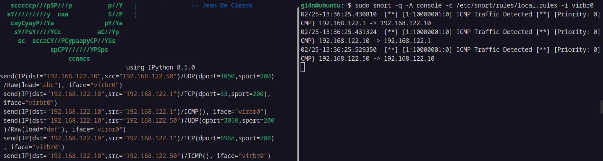

\

------------------------------------------------------------------------

**\
Report**\
*FreeRTOS: Ingress Firewall*\

------------------------------------------------------------------------

Giorgio {.smallcaps}\

Luca {.smallcaps}\

Michele {.smallcaps}\

Gianfranco {.smallcaps}\

:::

# Introduction

In the following report, we will address the and requirements. Having
implemented 3 demos related to the requirement, covering both memory
management in FreeRTOS and scheduling with preemptive and non-preemptive
cases, we have decided to proceed with point 3 by developing an [ingress
packet filter]{.underline}, a basic implementation of a **firewall**.\
Specifically we will apply a thorough packet filter by analyzing certain
fields, such as IP addresses, ports and protocol, and allowing or
denying the entry of each single packet traversing the IP stack of
FreeRTOS. In our case the packets are generated with the **Scapy** tool,
which generates packets based on various protocols ( e.g. TCP, UDP,
ICMP).\
The rules are defined as a **whitelist**, meaning that only those
packets that match with one of the rules are allowed. The following
snippet represents the rule type we defined. These rules are defined at
**compile-time** by exploiting the *rulegen.py* script that parses
*YAML*-like input rules into an array of rules defined in the
**rules.h** header.

        typedef struct rule {
          uint32_t src;  // Source IP address in network byte order
          uint32_t dst;  // Destination IP address in network byte order
          uint16_t port_src; // Source port number in network byte order
          uint16_t port_dst; // Destination port number in network byte order
          uint8_t proto; // 2-bit mask representing protocol type
          uint8_t action; //action to do with packets from the source ip 0 >> accept packets 1 >> reject packets
        }Rule;

Additionally, the Project decisions carried out are easily compatible
with a **blacklist** approach, by just re-defining the *action* field in
the rules. This approach was taken in order to enhance the
interoperability of our Project also to other use-cases.

# Development

Firstly, by examining the source code of **FreeRTOS-Plus-TCP**, various
files dedicated to packet handling in FreeRTOS can be observed. Through
the study of the source code, we have managed to identify the diagram
that specifies the flow of all packets arriving to the network
interface, followed by their subsequent management through various
functions. More specifically, the packets are processed in the
**FreeRTOS_IP.c** file, which contains a function named
**prvProcessIPPacket**, that processes the packets at *L3*, defined as
follows:

       static eFrameProcessingResult_t prvProcessIPPacket( const IPPacket_t * pxIPPacket, NetworkBufferDescriptor_t * const pxNetworkBuffer );

Which inputs are:

1.  A pointer to the structure representing the packet's IP header:

            struct xIP_PACKET
        {
            EthernetHeader_t xEthernetHeader;
            IPHeader_t xIPHeader;
        }

2.  A pointer to the structure representing the Network_Buffer:

        typedef struct xNETWORK_BUFFER
        {
            ListItem_t xBufferListItem;                /**< Used to reference the buffer form the free buffer list or a socket. */
            IP_Address_t xIPAddress;                   /**< Source or destination IP address, depending on usage scenario. */
            uint8_t * pucEthernetBuffer;               /**< Pointer to the start of the Ethernet frame. */
            size_t xDataLength;                        /**< Starts by holding the total Ethernet frame length, then the UDP/TCP payload length. */
            struct xNetworkInterface * pxInterface;    /**< The interface on which the packet was received. */
            struct xNetworkEndPoint * pxEndPoint;      /**< The end-point through which this packet shall be sent. */
            uint16_t usPort;                           /**< Source or destination port, depending on usage scenario. */
            uint16_t usBoundPort;                      /**< The port to which a transmitting socket is bound. */
            #if ( ipconfigUSE_LINKED_RX_MESSAGES != 0 )
                struct xNETWORK_BUFFER * pxNextBuffer; /**< Possible optimisation for expert users - requires network driver support. */
            #endif

        #define ul_IPAddress     xIPAddress.xIP_IPv4
        #define x_IPv6Address    xIPAddress.xIP_IPv6
        } NetworkBufferDescriptor_t;

It is important to note how the decision to insert the firewall at this
specific point reduces the **attack surface** for the attackers. Lastly,
checks also on UDP and TCP packets (*L4*) are performed at this level,
instead of delaying this checks later on.

### Packet Flow Graph with the Firewall {#packet-flow-graph-with-the-firewall .unnumbered}

Within this function, two different packet handling methods are
distinguished based on the possible types of IP addresses associated
with a given packet. However, we will focus exclusively on analyzing
*IPv4 packets*.

The **firewall** is implemented by the *checkPacketAgainstRules*
function that filters the ingress packets by using the predefined rules.
The packet filter, was inserted right after Kernel's routine checks on
packets such as verifying the correctness of the header length. The
definition of the function is:

        uint8_t checkPacketAgainstRules(struct rule ruleset[], int num_rules,const IPHeader_t * pxIPHeader, NetworkBufferDescriptor_t const * pxNetworkBuffer))

The aforementioned function will return the value *0* when the packet
meets one of the defined rules, meaning that it is an allowed packet,
whereas, the value 1 when the packet is filtered as ineligible for
passage, hence, being a packet that doesn't respect the defined rules.\
The input parameters of the **checkPacketAgainstRules** function are:

1.  The structure of the ruleset defined at run-time in the rules.h
    header.

2.  Num_Rules that defines the number of rules implemented in the
    whitelist.

3.  Pointer to the structure of the incoming IP packet header that is
    defined as follow:

            struct xIP_HEADER
        {
            uint8_t ucVersionHeaderLength;        /**< The version field + internet header length 0 + 1 =  1 */
            uint8_t ucDifferentiatedServicesCode; /**< Differentiated services code point + ECN   1 + 1 =  2 */
            uint16_t usLength;                    /**< Entire Packet size, ex. Ethernet header.   2 + 2 =  4 */
            uint16_t usIdentification;            /**< Identification field                       4 + 2 =  6 */
            uint16_t usFragmentOffset;            /**< Fragment flags and fragment offset         6 + 2 =  8 */
            uint8_t ucTimeToLive;                 /**< Time to live field                         8 + 1 =  9 */
            uint8_t ucProtocol;                   /**< Protocol used in the IP-datagram           9 + 1 = 10 */
            uint16_t usHeaderChecksum;            /**< Checksum of the IP-header                 10 + 2 = 12 */
            uint32_t ulSourceIPAddress;           /**< IP address of the source                  12 + 4 = 16 */
            uint32_t ulDestinationIPAddress;      /**< IP address of the destination             16 + 4 = 20 */
        }

4.  The pointer to the structure defined below will be used to check the
    source and destination ports of the incoming packet for UDP and TCP
    packets. This parameter is needed in order to perform checks on *L4*
    information such as the ports, already at this point.

            NetworkBufferDescriptor_t const * pxNetworkBuffer

The function, after taking as input the previously declared values,
handles the incoming packet through a switch construct, addressing three
different protocol possibilities and in the default case the remaining
protocols.

1.  **ipPROTOCOL_UDP**

2.  **ipPROTOCOL_TCP**

3.  **ipPROTOCOL_ICMP**

4.  **default**

In the first case, which deals with **UDP** packets, the UDP header is
extracted and used as input in the following process:

        uint8_t checkPacketsWithPorts(struct rule ruleset[], int num_rules, const IPHeader_t * pxIPHeader, uint16_t usSourcePort, uint16_t usDestinationPort)

It uses the following input parameters:

1.  The predefined ruleset

2.  The global constant num_rules

3.  Pointer to the IP packet header

4.  Source port of the packet. Extracted from the UDP header from the
    NetworkBufferDescriptor type passed.

5.  Destination port of the packet. Extracted from the UDP header from
    the NetworkBufferDescriptor type passed.

The check performed on incoming UDP packets is the following one:

        for (i = 0; i < num_rules; i++) {
            if(pxIPHeader->ucProtocol==6){
            if (pxIPHeader->ulSourceIPAddress == ruleset[i].src &&
                pxIPHeader->ulDestinationIPAddress == ruleset[i].dst &&
                usSourcePort == ruleset[i].port_src &&
                usDestinationPort == ruleset[i].port_dst &&
                pxIPHeader->ucProtocol == ruleset[i].proto) {
                return ruleset[i].action; // match found execute corresponding action on the packet this can be used both as blakclist and whitelist.
            }
        return 1; // Forbidden packet, hence has to dropped.

The second case, instead, deals with **TCP** packets. At the
implementation level, a pointer **pxProtocolHeaders** is extracted using
this procedure.

        const ProtocolHeaders_t *pxProtocolHeaders = ( ( ProtocolHeaders_t * ) &( pxNetworkBuffer->pucEthernetBuffer[ ipSIZE_OF_ETH_HEADER + uxIPHeaderSizePacket( pxNetworkBuffer ) ] ) );

Subsequently, this result is used in the **checkPacketsWithPorts**
function (above mentioned), performed the same check performed for UDP
packets on ports, addresses and protocol.\
If the **checkPacketsWithPorts** function returns the value 1, thus not
respecting the firewall rules, the packet is **not authorized**.\
Subsequently, for the dropped packets the **writeToPcap** function is
invoked, which takes as input the IP header, the source port, and the
destination port extracted from the **NetworkBufferDescriptor_t**.

        void writeToPcap(const IPHeader_t  * pxIPHeader, uint16_t usSourcePort, uint16_t usDestinationPort)

This function will write to the standard output, which is then parsed by
the *pcap.py* script that parses the log output by recognizing specific
keys related to dropped packets. The dropped packets will be transformed
in packets representable in *.pcap* format and saved in the
*packets.pcap* file.

The third case, instead, deals with **ICMP** packets. At the
implementation level, a pointer **pxProtocolHeaders** is extracted using
this procedure.

        ICMPPacket_t * pxICMPPacket = ( ( ICMPPacket_t * ) pxNetworkBuffer->pucEthernetBuffer );
        IPHeader_t pxIPHeaderofICMPPacket = (IPHeader_t *)& (pxICMPPacket->xIPHeader);

And the result is used in the function defined below:

        uint8_t checkIPs(struct rule ruleset[], int num_rules, const IPHeader_t * pxIPHeader)

This function verifies the source IP address, the destination IP
address, and the protocol, for those packets that do not carry
information regarding the ports. If the packet is discarded, the
function **writeToPcap** is invoked with **usSourcePort** and
**usDestinationPort** statically set to -1, as they are not defined by
ICMP protocol

The default case treats all remaining protocols by performing a check on
the addresses and the protocol defined in the rules. Again, the function
used is the **uint8_t checkIPs** function abovementioned.

## Ruleset generation

To generate the rules that we inject statically into the **rules.h**
file a Python script, named *rulegen.py* that translates from
*YAML*-like input of the firewall rules to a header file *rules.h*
defining an array of rules at compile-time.

## Packet generation

The packets sent to the network card were generated via the **Scapy**
module in Python.

## Pcap Output

The output in *.pcap* format of the dropped packets by the firewall are
generated by the *pcap.py* script.

# Performance Evaluation

## Automation

All the configuration, compiling, linking and running of the and parts
were automated by bash scripts, namely the *run_demo.sh* and the
*fireDemoLauncher.sh*.

-   run_demo.sh: runs a TCP echo demo to test the TCP stack of the
    FreeRTOS Kernel.

-   fireDemoLauncher.sh:

    -   Allows to define the firewall rules in YAML format, injects them
        into a C array of rules defining the firewall via the rulegen.py
        script.

    -   Starts QEMU and generates 6 packets (2 UDP, 2 TCP, 2 ICMP) via
        the *Scapy* tool, with 3 of them allowed packets and 3 of them
        forbidden packets. One allowed packet for each protocol and one
        forbidden packet for each protocol.

    -   The designed firewall will drop the 3 forbidden packets and
        produce a log file *out.log* containing information regarding
        the dropped packets.

    -   The dropped packets' information in the log file will be parsed
        by the *pcap.py* script which generates a .pcap file containing
        the packets dropped by the firewall.

## firewall Performance

In the following images, firstly, the packets sent to the network card
will be presented. Secondly, the dropped packets by the firewall will be
shown.

### Sent Packets {#sent-packets .unnumbered}

### Firewall: Dropped Packets {#firewall-dropped-packets .unnumbered}

As the images show the designed firewall is able to **effectively**
filter the non-permitted packets by not allowing them and therefore
preventing them from being fully processed by the FreeRTOS Kernel.

# Future Work

As we were dealing with the Project 2 additional features that can be
added in the future are:

-   Intrusion Detection System (IDS) Integration to create a double line
    of defense.

-   Support for IPv6 packets.

### IDS Integration {#ids-integration .unnumbered}

Regarding the IDS we already performed an initial study and
implementation of this possible integration by exploiting the **Snort**
IDS, which is an open-source Intrusion Detection System. The IDS can be
placed either before the firewall, if used in blacklist, in order to
better set the rules; or after the firewall in order to perform a more
thorough checks on the allowed packets.

For now, we decided to position the IDS before the firewall in order to
get more information regarding the Ingress Flow. Additionally, the only
rule we have set for now is to produce an alert for incoming and
outgoing ICMP packets, which can be exploited to perform some attacks
such as ICMP flooding attacks.
Of course, more rules can be added. Hence, this is why we inserted this
solution still as a *Future Work*.

# Division of work

-   Part 1 : Luca, Michele and Giorgio

-   Part 2 : Luca and Gianfranco

-   Part 3 : Giorgio, Luca, Gianfranco and Michele

-   Part 4 : Giorgio, Michele and Gianfranco

Honorable mention goes to Luca for the automation scripts for the
scheduling demos and the whole fireDemoLauncher.
